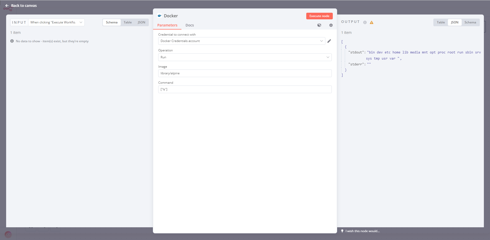

# n8n-nodes-container

This is an n8n community node. It lets you use Docker in your n8n workflows.

Docker is a set of platform as a service (PaaS) products that use OS-level virtualization to deliver software in packages called containers. Containers are isolated from one another and bundle their own software, libraries and configuration files; they can communicate with each other through well-defined channels. All containers are run by a single operating system kernel and are thus more lightweight than virtual machines. Containers are created from images that specify their precise contents. Images are often created by combining and modifying standard images downloaded from public repositories.

[n8n](https://n8n.io/) is a [fair-code licensed](https://docs.n8n.io/reference/license/) workflow automation platform.

[Installation](#installation)
[Operations](#operations)
[Credentials](#credentials)  <!-- delete if no auth needed -->
[Compatibility](#compatibility)
[Resources](#resources)

## Installation

Follow the [installation guide](https://docs.n8n.io/integrations/community-nodes/installation/) in the n8n community nodes documentation.

## Operations

We add a new node called `Docker`, which allow users interact with docker

## Credentials

We add a new credential, which can be socket path or remote docker host

## Compatibility

Maybe all?

## Resources

* [n8n community nodes documentation](https://docs.n8n.io/integrations/community-nodes/)
* [docker](https://www.docker.com/)
